# Introduction

The Attendance and Access Control Management System (AACMS) is a system designed to keep track of all official staff movements.

## Who Benefits From The Attendance And Access Control Management System

- Human Resource Management Personnels
- Information Technology Officials
- Members of Management

## System Input

- Staff Daily Clock-Ins
- Postings from the Human Resource Management System 
    
## System Output

- Summary Attendance Report
- Summary Access Control Report
- Detail Attendance Report
- Detail Access Control Report

## AACMS Module

Upon a successful sign in, a dashboard is displayed as shown in Figure 4.
Highlighted in red, is the AACMS module.
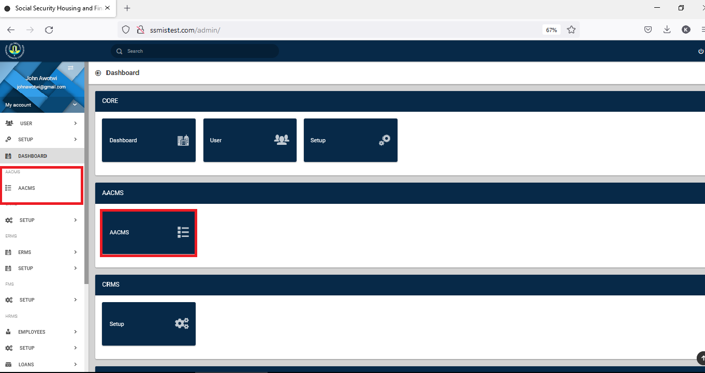{ align=center }

In this instance, we will be looking at the AACMS module. This module helps generate various reports as outputs based on member/staff attendance. Clicking AACMS in the dashboard or on the sidebar opens a portal that allows users generate various reports as shown in Figure 5.
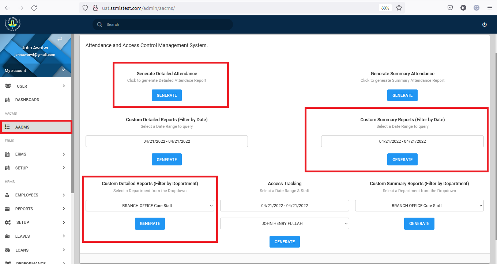{ align=center }

- Button One (1): This button generates a detailed attendace report shown in  Figure 6.
- Button Two (2): This button generates a summary attendance report shown in Figure 7.

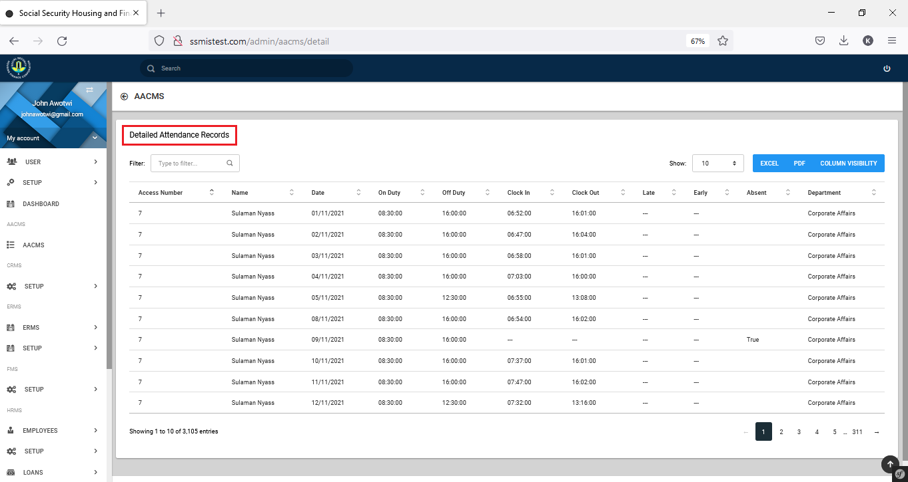{ align=left }
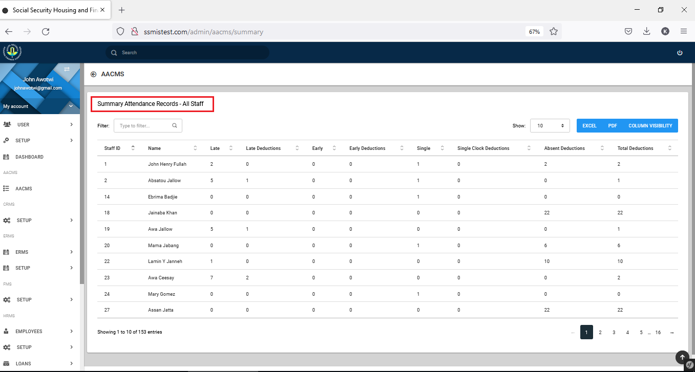{ align=right }

## Filtering Detailed Reports By Date

Detailed report can be filtered by dates. The filter generates information within a date range.
See Figure 8.
{ align=center }

Below is a sample, generated between the date range **1st to 27th of November 2021**
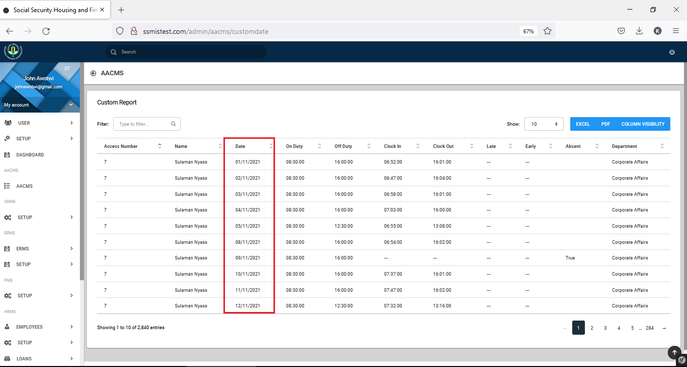{ align=center }

## Filtering Detailed Reports By Department
A detailed report can also be filtered by department as shown in Figure 10 and 11. A list of departments are generated in a dropdown to make selection easier.
{ align=left }
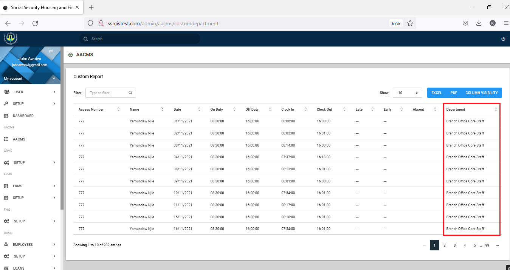{ align=right }
## Working With Reports

All reports come with certain functionalities, they are:

- Ability to export into pdf.*
- Ability to export into excel.*
- Ability to search by any of the fields in a mutli-field search box. **
- Ability to perform basic sort functions: Ascending and Descending.***
- Ability to limit column visibility. *

The figues below point out these functionalities.

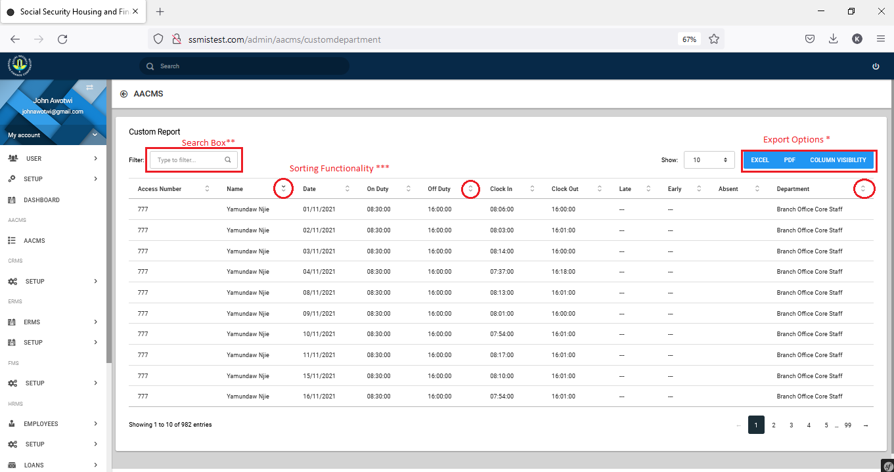{ align=center }

Output for Excel and PDF exports.

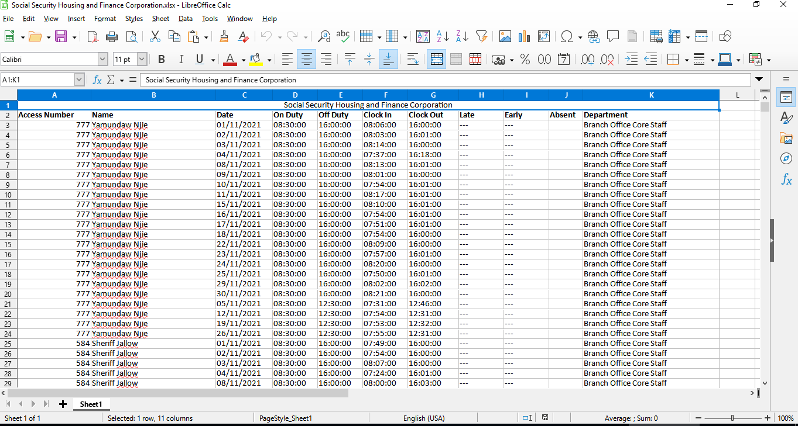{ align=center }
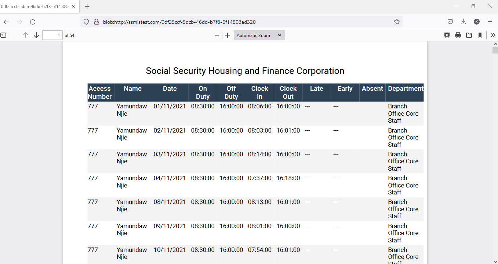{ align=center }

## Reducing Columns
The Ability to Limit or Select visible columns is done by clicking the **column visiblity** button and selecting out of the drop down,options you want to make hidden.
See Figure below.
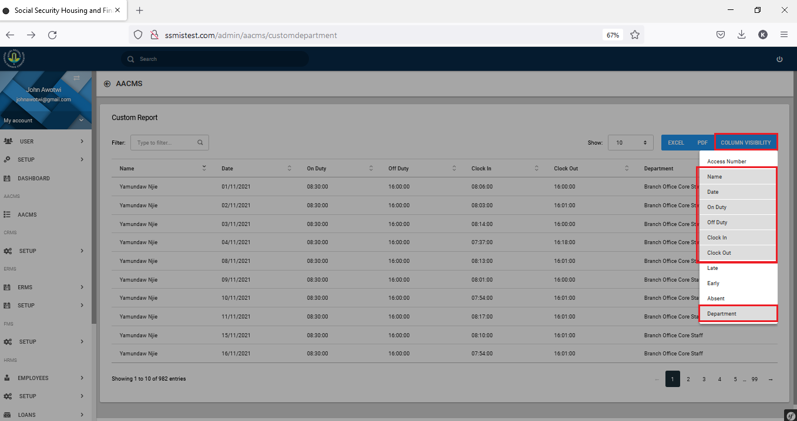{ align=center }

## Filtering Reports By Name
Using the filter/ Search box. You can search for anyting. See figure below.
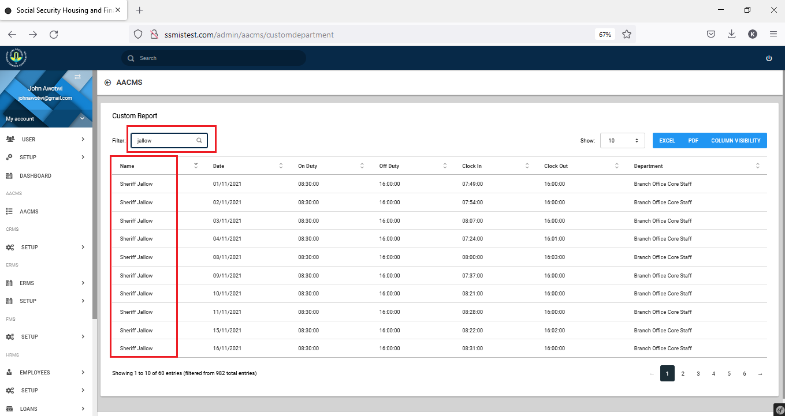{ align=center }

## Filtering Summary Reports By Date

This functionality is a similar process to filtering and attendance report by date. 

