# Introduction

The Human Resource Management System (HRMS) is a system designed to assist management take decisions that relate to workers

## Who Benefits From The Human Resource Management System

-  Members of Management
-  Human Resource Management Personnels
-  Information Technology Officials
## System Input

- Employment Application
- Leave Application
- Performance Appraisal
- Intern Evaluation
- Payroll Update(s)
- Training Application
- Excuse Off-Duty Application
- Loan Application(s)
- Overtime Pay Application
- Staff Registration
- Medical Form(s)
- Payroll Data Sources

## Required Information for Full Time Workers’  Registration

- Taxpayer Identification Number (TIN)
- Appropriately assigned Staff Salary Grade
- Appropriately assigned Staff  Income Tax
- Appointment Letter containing:
    -  name
    -  department
    -  basic grade
    -  allowances
    -  staff number
-  Bank Details comprising of:
    - bank name
    - basic bank account number
    - account number

## Required Information for Temporary Workers’ Registration

- Name
- Basic Pay
- Transport Allowance
- Residency
- Gross Pay

## Required Information for Interns’ Registration

- Name
- Basic Allowance
- Transport Allowance
- Gross Pay

## System Output

|  |  |  |  |  |
|---|---|---|---|---|
|  			  				Staff 				Profile 			 		                |  			  				Pay 				Slips 			 		                |  			  				Payroll 				Tracker 			 		                |  			  				Performance 				Analysis 			 		                |  |
|  			  				Credit 				Union 			 		                |  			  				FPS 				Contributions 			 		                |  			  				Monthly 				Allowance 			 		                |  			  				Allowances 				and Deductions Profile 			 		                |  |
|  			  				Detailed 				Payroll 			 		                |  			  				Bank 				Schedules 			 		                |  			  				View 				Loan Details 			 		                |  			  				Detailed 				Payroll by Department(s) 			 		                |  |
|  			  				Loan 				Summary 			 		                |  			  				Payroll 				Abstract 			 		                |  			  				Acting 				Allowance 			 		                |  			  				Exports 				By Department(s) 			 		                |  |
|  			  				Charge 				Allowance 			 		                |  			  				Active 				Staff 			 		                |  			  				Inactive 				Staff 			 		                |  			  				List 				of All Employees 			 		                |  |
|  			  				Payroll 				Summary 			 		                |  			  				NPF 				Contributions 			 		                |  			  				Staff 				Club(s) 			 		                |  			  				Breakdown 				Of All Deduction(s) 			 		                |  |
|  			  				Income 				Tax(es) 			 		                |  			  				Leave 				Analysis 			 		                |  			  				Net 				Comparison 			 		                |  			  				Basic 				Salary By Department(s) 			 		                |  |
|  			  				Exportable 				Reports 			 		                |  			  				Staff 				 Loan  Profile 			 		                |  			  				Overtime 			 		            |  			  				Report 				of Grades and Department 			 		                |  |
|  			  				Net 				Salary By Department(s) 			 		                |  			  				List 				of Employees By Department(s) 			 		                |  			  				Staff 				Medical Profile 			 		                |  			  				Gross 				Salary by Department 			 		                |  |

## Allowable Human Resource Postings

- Loans
    - building loan
    - vehicle loan
    - personal loan
    - interest free vehicle insurance loan
    - interest free one-by-six loan
    - interest free educational loan
    - interest free miscellaneous loan
    - furniture loan
    - appliance loan
- Allowances
     - charge allowance
     - acting allowance
     - professional allowance
     - transport allowance
     - residential allowance
     - confidential allowance
     - heavy duty allowance
     - risk allowance
     - project allowance
- Refunds
     - underpayment
     - medical bill(s)
- Deductions
     - medical admission(s)
     - credit union
     - lateness/absence
     - part salary advance
     - over payments
     - mid month
     - frame of lens
     - surcharge(s)

## Working With Employees’ Information

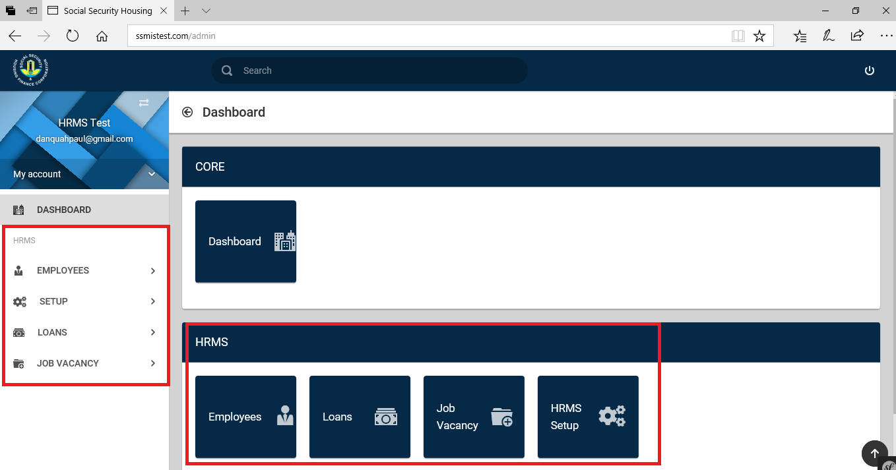{ align=center }

The higlighted areas, in red show the HRMS module.
Several sub modules make up the HRMS platform.
First is the Employee sub-module. Clikcing on the Employee button ,  brings up a page containing all employees’ information.
See Image below.

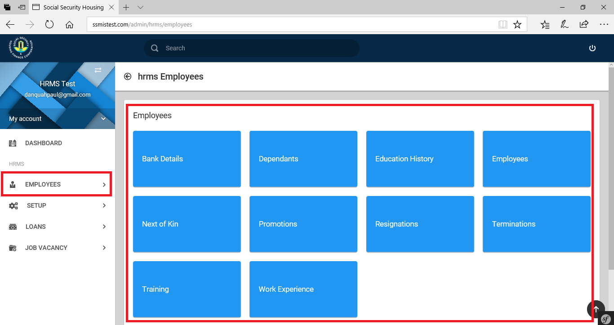{ align=center }

The various actions you can take on this page are as listed:
- access/edit/add/delete employee bank details.
- access/edit/add/delete employee dependants’ details.
- access/edit/add/delete employee education details.
- access/edit/add/delete/view employee employment details.
- access/edit/add/delete information on employees’ next of kin.
- access/edit/add/delete information on employees’ in house training.
- access/edit/add/delete information on employees’ work experience.
- access/edit/add/delete  information on employees’ promotion(s). 
- access/edit/add/delete  information on employees’ resignation(s). 
- access/edit/add /delete information on employees’  termination(s).

### Employee Bank Details
Clicking on the bank details button to **access/edit/add/delete employee bank details** opens a form as shown below;
On this page, you can add  an employees bank details, you can filter out or search for a specific employees details by typing out related information: the name, the branch, account number etc and as you type, the information is filtered and result displayed. On this same page you can edit as well as delete a record. You are at liberty to decide on the number of visible rows. A max of 100 is allowed. This form also allows you to generate and download a employees bank details as PDF, CSV, EXCEL or COPY displayed rows to your clipboard.

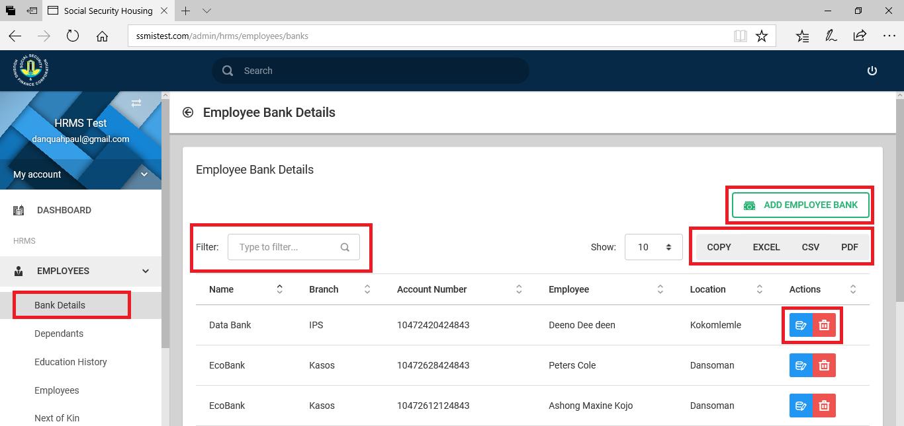{ align=center }

Clicking to add/edit an employee’s bank details opens a form as shown in the Figues below.
When adding/editing an employee’s bank details, information for fields marked with * must be provided. 

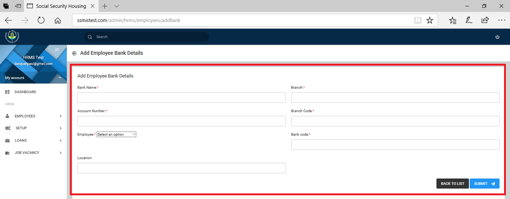{ align=center }

### Employee Dependants

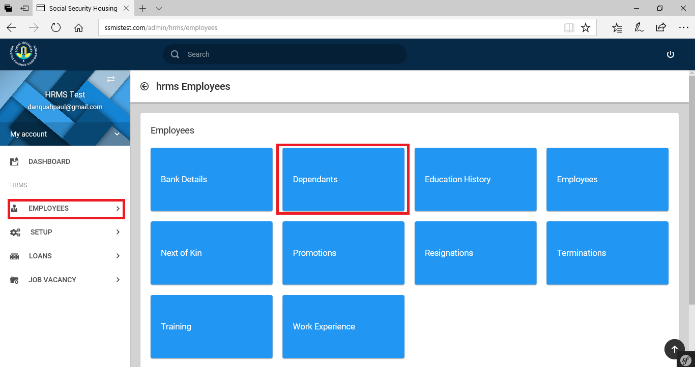{ align=center }

Clicking on the dependents button to **access/edit/add/delete employee dependants’ details** opens a table as shown in the figure below. 

{ align=center }

On this page,  you can add, edit or delete a dependant, filter acros the list of dependants, limit or increase the visible dependants, export as PDF, EXCEL,CSV or COPY to your clipboard rows of visible dependants.
The form below shows the form needed for adding a dependant. Information for fields marked with  * must be provided.

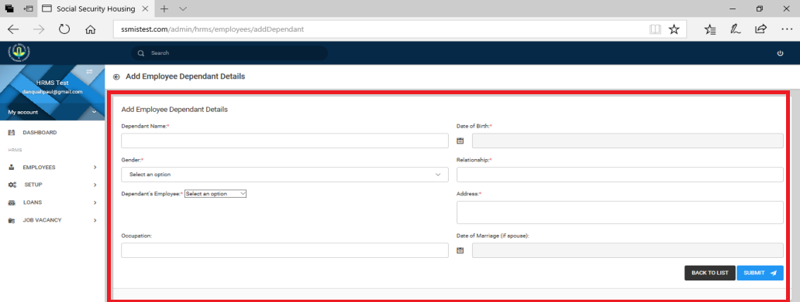{ align=center }

### Education History

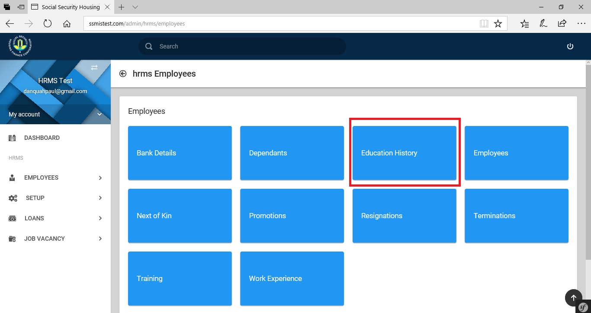{ align=center }

Clicking on the education history button to access/edit/add/delete details of an employee’s education opens a table as shown in the figure below.

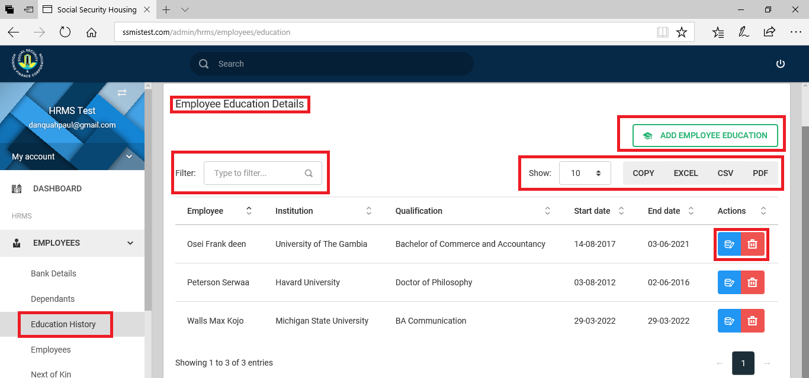{ align=center }

On this page,  you can add, edit or delete an employees education history, filter acros the list of records, limit or increase the visible records, export as PDF, EXCEL,CSV or COPY to your clipboard rows of visible records.
The form below shows the form needed for adding an education history record. Information for fields marked with  * must be provided

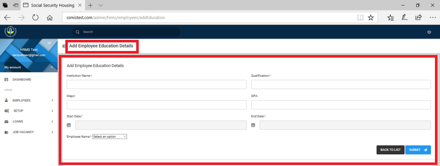{ align=center }

### Employee

{ align=center }

Clicking on the employees button to access/edit/add/delete/view details of an employee opens a table as shown in the image below.

{ align=center }

The HUD (Heads Up Display), on the page shows:

-  1.Displays total number of permanent staff.
-  2.Displays total number of contract staff.
-  3.Displays total number of interns. 

The new addition to the action buttons is the **view button**.  This allows you to view employee employment details.

### Next of Kin
{ align=center }

Clicking on the next of kin button to access/edit/add/delete details of an employee’s next of kin opens a table as shown in figure below

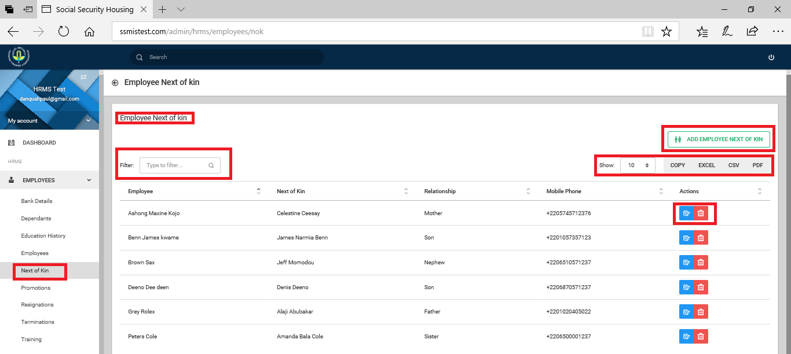{ align=center }

On this page,  you can add, edit or delete an employees next of kin, filter acros the list of records, limit or increase the visible records, export as PDF, EXCEL,CSV or COPY to your clipboard rows of visible records.
Clicking to add/edit an employee’s next of kin’s details opens a form as shown in figure below.
When adding/editing an employee’s next of kin’s details,information for fields marked with  * must be provided.

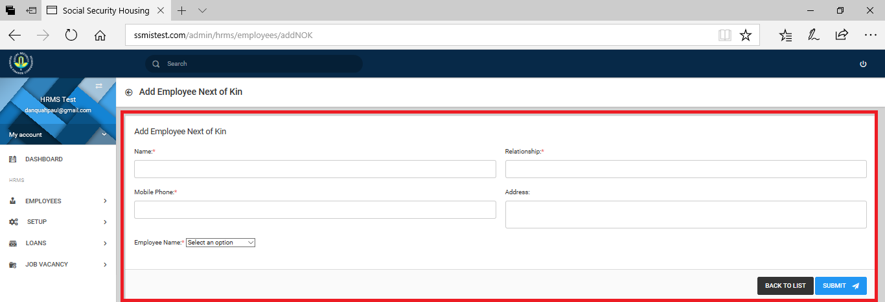{ align=center }

### Promotions

## Working With The Human Resource Management System Setup
## Working With Loans

## Working On Job Vacancies

