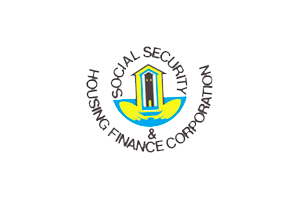
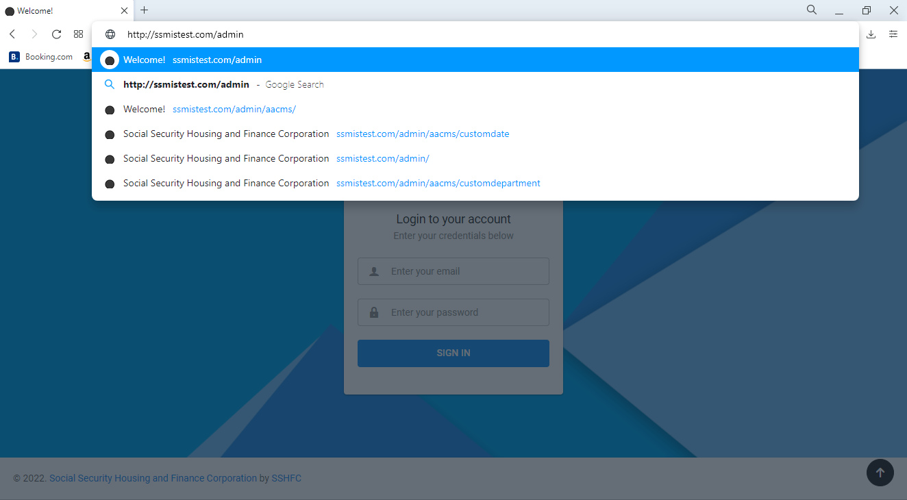
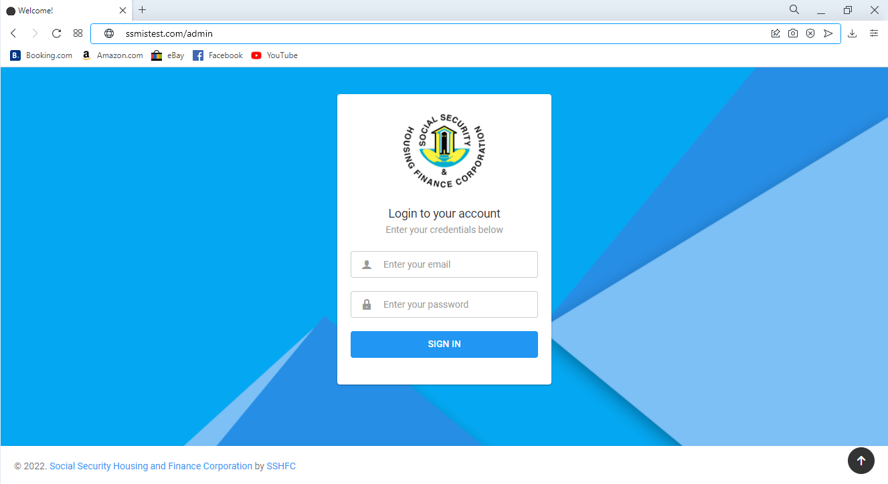
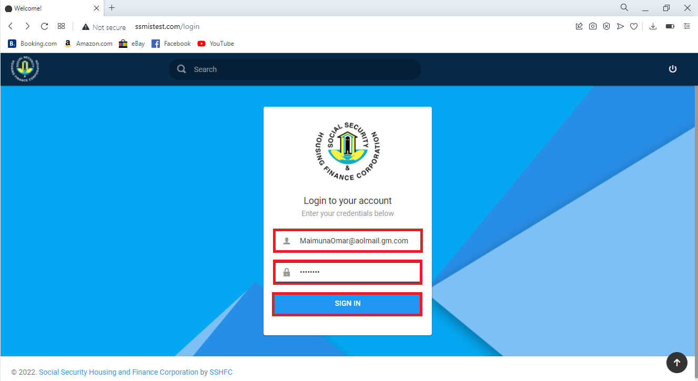

THE GAMBIA

SOCIAL SECURITY AND HOUSING FINANCE CORPORATION (SSHFC)

<figure markdown>
  { width=300 }
</figure>

    System User Manual

## Getting Started

## Modules
* [`Admin` - Administrative User Manual](admin.md) 
* [`AACMS`-  Attendance and Access Control Management System.](aacms.md)
* [`CMS` - Claims Monitoring System](cms.md) 
* [`CRMS` -  Customer Relations Management System](crms.md) 
* [`ERMS` - Electronic Records Management System ](erms.md)
* [`HRMS` - Human Resource Management System](hrms.md) 
* [`MMS` - Mortgage Management System](mms.md) 
* [`FMS` - Financial Management System](fms.md)
* [`SSMS` - Social Security Management System](ssms.md)

## Minimum Browser Requirements 
The System is designed with minimal expectations from a user’s browser. A user will simply require the latest version of any browser with JavaScript enabled.

## Accessing The Web Application

**Type http://ssmistest.com/admin in your address bar as shown in Figure 1.**
{ align=center }

**When the right address is entered, a SIGN IN page is displayed as shown in Figure 2.**
{ align=center }

## Navigating The System’s Web User Interface

Users must have been provided with email addresses and are required to create easy to remember passwords using a combination of letters, numbers and symbols to enable them to log in to their accounts.

Login to your account by filling out the sign-in form with your email address and password and clicking on the SIGN IN button as shown in Figure 3.

{ align=center }

 
## The Dashboard

After a successful login, the user is presented with a dashboard.
This dashboard displays all modules installed for the user account in question. See the image below.

{ align=center }
